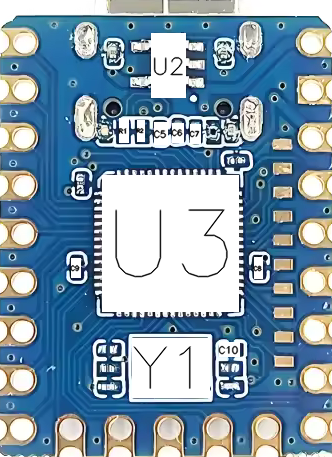

# BoardMapper

## Aperçu


BoardMapper est un outil open-source conçu pour générer automatiquement des schémas d'implantation pour des circuits imprimés (PCB). Il note les références des composants (par exemple U1, R1, C1) directement sur l'image du circuit, ce qui facilite l'identification des composants à des fins de rétro-ingénierie.

## Objectif
- **Automatisation** : Élimine la nécessité d'annoter manuellement le placement des composants sur les schémas de PCB.
- **Efficacité** : Économise du temps pour les ingénieurs et les créateurs travaillant sur l'assemblage et le débogage des PCB.
- **Clarté** : Fournit une référence visuelle claire pour le dépannage, les tests et la fabrication.
- **Multi-plateforme** : Fonctionne sous Windows, Linux et macOS.

## Annotation

| Position | Original | Annoté |
|----------|---------|-----------|
| **Top** |  |  |
| **Bottom** |  |  |

## Prérequis
- **Python** : Version 3.6 ou supérieure
- **Bibliothèques requises** :
  - `opencv-python` (pour le traitement d'images)
  - `lxml` (pour l'analyse XML)

## Instructions d'installation

### Configuration
1. **Cloner le dépôt** ou **Télécharger le projet** sur votre machine locale.

2. **Étiquetage du PCB** :
   - **Étape 1** : Prenez une photo des couches supérieure et inférieure du PCB choisi.
   - **Étape 2** : Placez les images `top.png` et `bottom.png` dans le dossier `input`.
   - **Étape 3** : Installez la dernière version de [LabelImg](https://github.com/HumanSignal/labelImg/releases).
   - **Étape 4** : Ouvrez `top.png` dans LabelImg et dessinez des boîtes englobantes autour de chaque composant. Étiquetez chaque composant selon son type :
     - **R** : Résistance
     - **C** : Condensateur
     - **L** : Inductance
     - **F** : Fusible
     - **POT** : Potentiomètre
     - **D** : Diode
     - **LED** : LED
     - **Q** : Transistor (BJT, MOSFET)
     - **U** : Circuit intégré (IC)
     - **J** : Connecteur
     - **K** : Relais
     - **SW** : Interrupteur
     - **Y** : Quartz / Résonateur
     - **SP** : Haut-parleur
     - **ANT** : Antenne
     
     **Raccourcis LabelImg** :
     - **W** : Dessiner une nouvelle boîte englobante (RectBox)
     - **D** : Supprimer la dernière boîte dessinée
     - **Ctrl + S** : Sauvegarder l'annotation en tant que fichier XML
     - **Ctrl + Z** : Annuler la dernière action
     - **Ctrl + C** : Copier une boîte englobante
     - **Ctrl + V** : Coller une boîte copiée
     - **Ctrl + A** : Sélectionner toutes les boîtes englobantes
     - **Ctrl + R** : Faire pivoter l'image (pour un meilleur étiquetage)
     - **Esc** : Annuler l'opération en cours ou fermer une boîte de dialogue

   - **Étape 5** : Après l'étiquetage de `top.png`, enregistrez l'annotation sous `top.xml`.
   - **Étape 6** : Répétez le processus pour `bottom.png` et enregistrez sous `bottom.xml`.
   - **Étape 7** : Placez `top.xml` et `bottom.xml` dans le dossier `input`.

3. **Exécution de l'outil** :
   - **Windows** : Double-cliquez sur `setup_and_run.bat` pour exécuter automatiquement le script. L'outil lira les annotations XML, dessinera les boîtes sur les images et enregistrera les images annotées.
   - **Linux/macOS** : Exécutez le script depuis le terminal :
     ```
     chmod +x script.sh
     ./script.sh
     ```

5. **Résultats** :
   - Après l'exécution du script, accédez au dossier `output` pour retrouver les images annotées :
     - `top_annotated.png`
     - `bottom_annotated.png`

## Contributions
Si vous souhaitez contribuer au projet, veuillez suivre ces étapes :
1. Forkez le dépôt
2. Créez une branche pour votre fonctionnalité
3. Commitez vos modifications
4. Poussez vers la branche
5. Ouvrez une pull request

Toutes les contributions visant à améliorer BoardMapper sont les bienvenues !

## Licence
Ce projet est open-source. N'hésitez pas à l'utiliser, le modifier et y contribuer !
